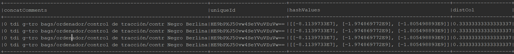
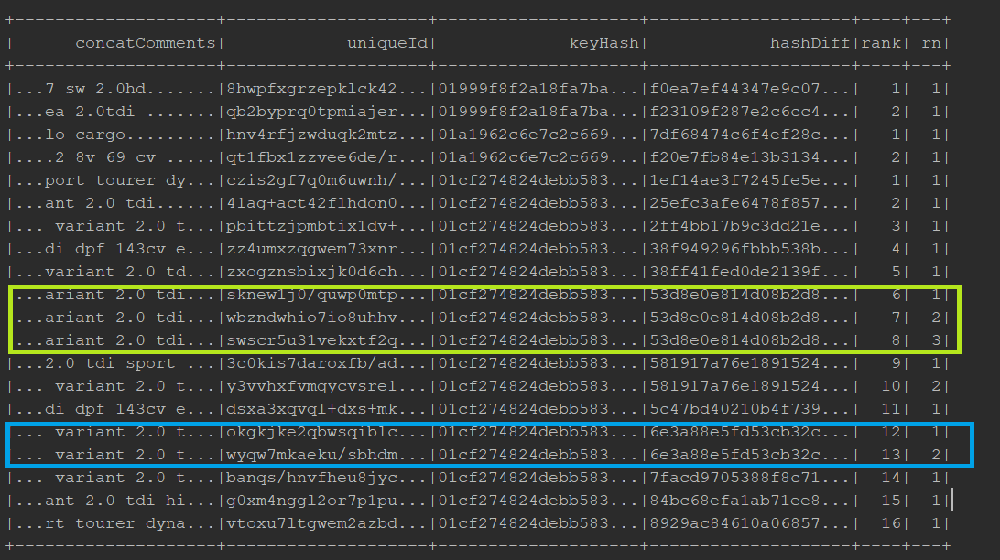
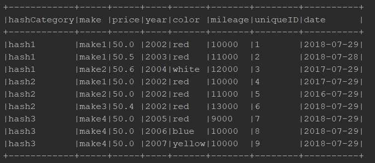
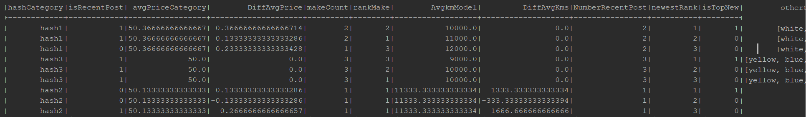
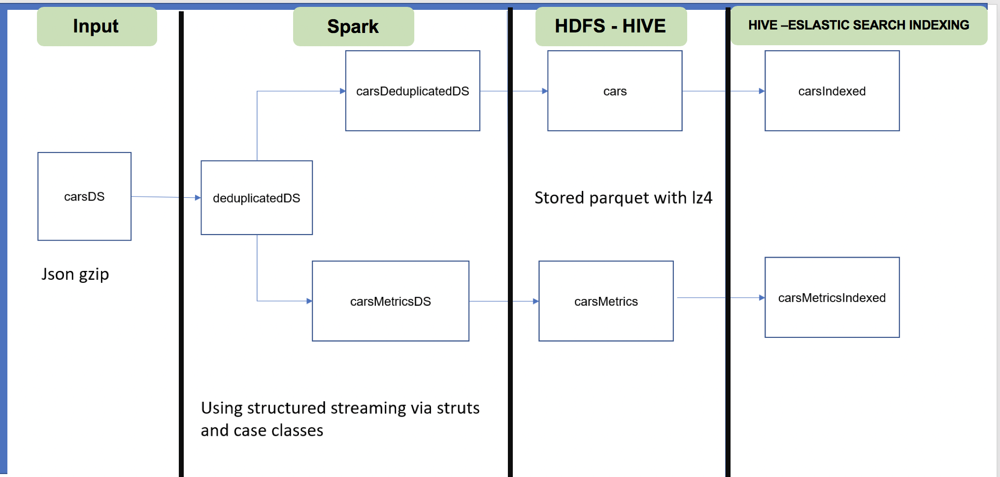

# Spark Data Deduplication #

This project shows a dataset deduplication process using spark and Scala. A deduplication process is worth in cases where having deuplicates affects either a distribuited system performance or your business metrics. Thus, this a basic example using a cars dataset having similar descriptions a fields, then the pipeline looks for similar rows and flag/remove those that represent the same record. 

### Deduplicate Data Frame ###

For this example a couple of strategies are used. Both of them reduce the space of the problem by some assumptions.
However, modify them for a real example is a matter of use the complete set of fields.

### Locality-sensitive hashing (LSH) ###

This strategy creates a column concatenating the principal component fields (PCA). For this test there is an assumption in order to reduce complexity and have a result in short time.

https://spark.apache.org/docs/2.2.0/mllib-dimensionality-reduction.html

Thus, those fields are:

  * titleChunk
  * contentChunk
  * color
  * carType

Therefore, it uses a tokenizer (with word stopper - see code) to get the vector for the LSH algorithm. This creates hashes and buckets. Finally, using KNN we can query similar hashes for a category.

* Pros:

    - Accurate: If a complete set of fields (representating the striing) is used, the correct value for hashes and neighbors could detect almost all the repeated values.
    - Faster: compared with other ML strategies as Tfi, etc.

* Cons :

    - Need a cluster with good resources.
    - Need a process for data cleaning.


To run an example: Go to the test ```com.sample.processor.cars.ProcessorCarsLshTest``` and you will see a complete flow running.

* Input Params:

  * category --> color = 'negro' and carType = 'tdi'.
  * nearNeighboursNumber --> 4
  * hashesNumber --> 3

* Results:




### Regular Spark Windows Functions Operations ###

This strategy uses spark windows operations over a multiHashing strategy. Steps:

  * Create a hash using some first level category field. This will be helpful for the partitioning of the data in nodes. For the example, these fields are:
       * carType
       * city
       * country
       * region
       * year
       * transmission
    Note: the "date" field helps to order and get only the most recent.
  * With this window, creates a second hash using extra cleaned parameters (after processing) a creates second window. The fields are:
       * doors
       * fuel
       * make
       * mileage
       * model
       * color
       * price
    Note: the "date" field helps to order and get only the most recent .
  * For each group applies levenshtein (string difference only in the second window) over the concatenated fields that changes the most and rank the window:
     * titleChunk
     * contentChunk
  * Finally the values with the same hashes and rank only change the rownum. Filtering rownum == 1 is possible to get
  the deduplicate Data set.

To run an example: Go to the test ```com.sample.processor.cars.ProcessorCarsWindowsTest``` and you will see a complete flow running.

* Input Params: levenshteinThreshold --> 6

* Results:



The results is deduplicate after filtering rn == 1. This removes > 1/3 of the data in the sample dataset.


* Pros:

    - More control in the spark partitioner and functions.

* Cons :

    - Could have much more false positives.

### Calculating Metrics ###

Regarding the metrics a subset of the fields and an example found in this test are used:

```com.sample.processor.cars.CarMetricsTest```

an example of the input calculating data for each car in a hash category that is generated for some key fields.
Those key field represent filters done by an user in the platform. Example:

HashKey = concat(carType,city,country,region,transmission)

The input example is:



The calculated fields are shown in this part of the code:
```

    val windowCarsKeyHash = Window.partitionBy(col("hashCategory"))
      .orderBy(col("hashCategory"))

    val windowCarsKeyHashMake = Window.partitionBy(col("hashCategory"),
      col("make")
    )

    val windowCarsKeyHashModel = Window.partitionBy(col("hashCategory"),
      col("year")
    )
      .orderBy(col("hashCategory"), col("make"))

carsDF
      .withColumn("isRecentPost", when(datediff(current_timestamp(), col("date")) > 10, 0).otherwise(1))
      .withColumn("avgPriceCategory",  avg("price").over(windowCarsKeyHash))
      .withColumn("DiffAvgPrice", col("price") - col("avgPriceCategory"))
      .withColumn("makeCount", count("uniqueID").over(windowCarsKeyHashMake))
      .withColumn("rankMake", dense_rank().over(windowCarsKeyHash.orderBy(desc("makeCount"), desc("year"))))
      .withColumn("AvgkmModel", avg(col("mileage")).over(windowCarsKeyHashModel.orderBy(desc("rankMake"))))
      .withColumn("DiffAvgKms", col("mileage") - col("AvgkmModel"))
      .withColumn("NumberRecentPost", sum("isRecentPost").over(windowCarsKeyHash))
      .withColumn("newestRank", row_number().over(windowCarsKeyHash.orderBy("mileage")))
      .withColumn("isTopNew", when(col("newestRank") === 1, 1).otherwise(0))
      .withColumn("otherColors", collect_set("color").over(windowCarsKeyHash))
```

The result is:



The results show metrics for each car comparing itself with the rest in the same group (window).

Therefore, we have a dataframe useful to show some time series with avg prices and counts. This Dataframe will be stored in a real time series
data base like Influx or elasticsearch for faster and easier lookups from a framework like tableau, etc. This metric will be shown to an user
in real time while he is looking for cars in a category. Example: Difference of price for car vs the rest in category.

Other databases could be taken into consideration: Cassandra, mongo, redis, etc.


This architecture is shown in the following diagram:




